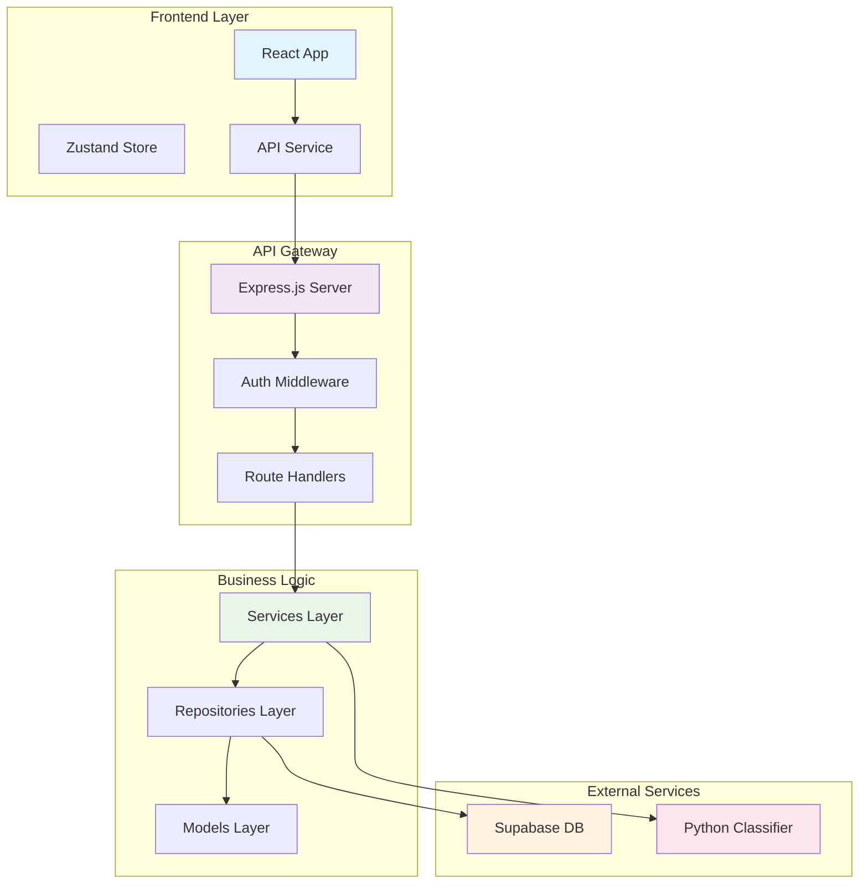
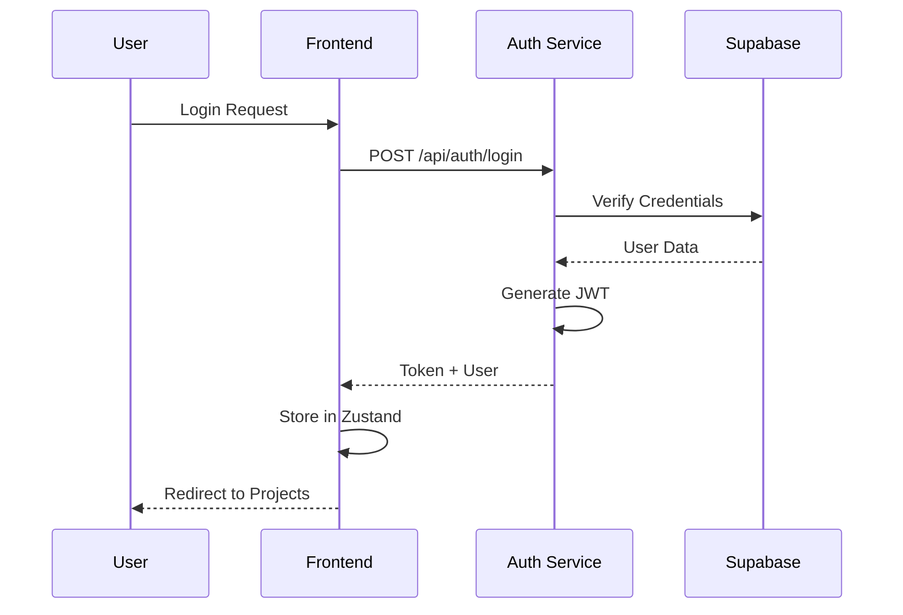
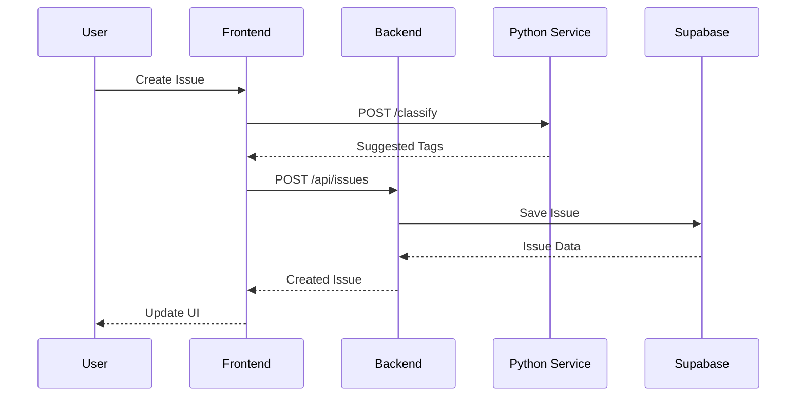
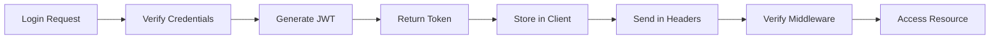
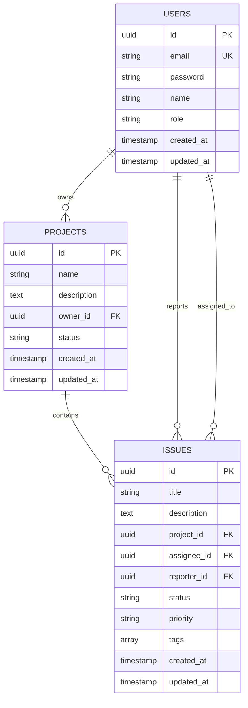

# Architecture Documentation

## Overview

El Issue Tracker implementa una arquitectura de microservicios con Clean Architecture, priorizando la escalabilidad, mantenibilidad y separación de responsabilidades.

## 🏗️ Arquitectura General



## 📁 Estructura del Proyecto

### Backend (Node.js - Clean Architecture)

```
src/
├── controllers/          # Presentation Layer
│   ├── auth.controller.js
│   ├── project.controller.js
│   └── issue.controller.js
├── services/            # Business Logic Layer
│   └── auth.service.js
├── repositories/        # Data Access Layer
│   └── index.js
├── models/              # Domain Models
│   └── index.js
├── middlewares/         # Cross-cutting Concerns
│   └── auth.middleware.js
├── routes/              # API Routes
│   ├── auth.routes.js
│   ├── project.routes.js
│   └── issue.routes.js
├── config/              # Configuration
│   └── database.js
└── utils/               # Utilities
```

### Frontend (React - Feature-based)

```
src/
├── pages/               # Feature Pages
│   ├── LoginPage.jsx
│   ├── ProjectsPage.jsx
│   └── IssuesPage.jsx
├── components/          # Reusable Components
│   └── ProtectedRoute.jsx
├── store/               # State Management
│   └── authStore.js
├── services/            # API Clients
│   └── api.js
└── utils/               # Utilities
```

### Python Service (Microservice)

```
python-service/
├── app.py               # FastAPI Application
├── requirements.txt     # Dependencies
├── classifier.py       # Classification Logic
└── Dockerfile          # Container Configuration
```

## 🔄 Flujo de Datos

### 1. Autenticación Flow



### 2. Issue Creation Flow



## 🎯 Patrones de Diseño Implementados

### 1. Clean Architecture

**Principio**: Dependencias hacia adentro

```javascript
// Controllers dependen de Services (no al revés)
export class AuthController {
  static async login(req, res) {
    // Controller solo maneja HTTP
    const result = await AuthService.login(credentials);
    res.json(result);
  }
}

// Services dependen de Repositories
export class AuthService {
  static async login(credentials) {
    const user = await userRepository.findByEmail(email);
    // Lógica de negocio pura
  }
}
```

### 2. Repository Pattern

**Principio**: Abstracción del acceso a datos

```javascript
export class BaseRepository {
  async create(data) {
    const { data: result, error } = await supabase
      .from(this.tableName)
      .insert(this.model.toDatabase(data));
    if (error) throw error;
    return this.model.fromDatabase(result);
  }
}
```

### 3. Dependency Injection

**Principio**: Invertir dependencias

```javascript
// Los controllers reciben sus dependencias
export class ProjectController {
  constructor(projectRepository = new ProjectRepository()) {
    this.repository = projectRepository;
  }
}
```

### 4. Middleware Pattern

**Principio**: Cross-cutting concerns

```javascript
export const authenticateToken = async (req, res, next) => {
  try {
    const token = req.headers.authorization?.split(' ')[1];
    const decoded = AuthService.verifyToken(token);
    req.user = await userRepository.findById(decoded.id);
    next();
  } catch (error) {
    res.status(401).json({ error: 'Invalid token' });
  }
};
```

## 🔐 Modelo de Seguridad

### 1. Autenticación JWT



**JWT Payload Structure:**
```json
{
  "id": "user-uuid",
  "email": "user@example.com",
  "role": "user",
  "iat": 1640995200,
  "exp": 1641081600
}
```

### 2. Rate Limiting (Login Attempts)

```javascript
const loginAttempts = new Map();

export class LoginAttemptService {
  static MAX_ATTEMPTS = 3;
  static LOCKOUT_DURATION = 3 * 60 * 1000; // 3 minutes
  
  static isLocked(email) {
    const attempt = loginAttempts.get(email);
    return attempt && Date.now() < attempt.lockUntil;
  }
}
```

### 3. Seguridad de Datos

La seguridad de datos está manejada a nivel de aplicación mediante:
- **Autenticación JWT**: Tokens firmados con secret key
- **Middleware de autorización**: Verifica ownership antes de operaciones
- **Validación de inputs**: Prevención de inyección SQL y XSS
- **CORS configurado**: Solo permite requests del frontend autorizado

**Nota**: Las políticas de Row Level Security (RLS) de Supabase están **desactivadas** en este proyecto. La autorización se maneja completamente en el backend Node.js.

## 🗄️ Modelo de Datos

### Entity Relationships



## 🏛️ Principios SOLID Aplicados

### 1. Single Responsibility Principle (SRP)

```javascript
// ✅ Cada clase tiene una sola responsabilidad
class UserRepository { // Solo acceso a datos de usuarios
class AuthService {     // Solo lógica de autenticación
class AuthController {  // Solo manejo HTTP de auth
```

### 2. Open/Closed Principle (OCP)

```javascript
// ✅ Abierto para extensión, cerrado para modificación
export class BaseRepository {
  // Métodos base que no cambian
  async create(data) { /* implementación base */ }
  async findById(id) { /* implementación base */ }
}

export class UserRepository extends BaseRepository {
  // Extiende sin modificar el base
  async findByEmail(email) { /* nueva funcionalidad */ }
}
```

### 3. Liskov Substitution Principle (LSP)

```javascript
// ✅ Las subclases pueden sustituir a la clase base
function processRepository(repository) {
  return repository.create(data); // Funciona con cualquier repository
}

processRepository(new UserRepository());
processRepository(new ProjectRepository());
```

### 4. Interface Segregation Principle (ISP)

```javascript
// ✅ Interfaces específicas en lugar de interfaces grandes
export class AuthService {
  static generateToken(user) { /* solo auth */ }
  static verifyToken(token) { /* solo auth */ }
}

export class PasswordService {
  static hashPassword(password) { /* solo passwords */ }
  static comparePassword(password, hash) { /* solo passwords */ }
}
```

### 5. Dependency Inversion Principle (DIP)

```javascript
// ✅ Depende de abstracciones, no de implementaciones
export class ProjectController {
  constructor(projectRepository) { // Inyección de dependencia
    this.repository = projectRepository;
  }
}
```

## 🔄 Flujo de Comunicación entre Servicios

### 1. Síncrono (HTTP)

```javascript
// Backend llama al servicio Python
const classificationResponse = await fetch('http://localhost:8001/classify', {
  method: 'POST',
  headers: { 'Content-Type': 'application/json' },
  body: JSON.stringify({ title, description })
});
```

### 2. Asíncrono (Event-driven - Futuro)

```javascript
// Para escalabilidad: eventos en lugar de llamadas directas
eventEmitter.emit('issue.created', { issueId, title, description });
```

## 📊 Métricas y Monitoreo

### 1. Health Checks

```javascript
// Backend
app.get('/health', (req, res) => {
  res.json({ status: 'ok', service: 'issue-tracker-api' });
});

// Python Service
@app.get("/health")
async def health_check():
    return {"status": "ok", "service": "issue-classifier"}
```

### 2. Logging Estructurado

```javascript
console.error('Login error:', {
  email,
  timestamp: new Date().toISOString(),
  error: error.message,
  stack: error.stack
});
```

## 🚀 Escalabilidad

### Horizontal Scaling

```yaml
# Docker Compose ready for scaling
services:
  backend:
    # ... configuración
  python-service:
    # ... configuración
  frontend:
    # ... configuración
  nginx:
    image: nginx:alpine
    ports:
      - "80:80"
    depends_on:
      - backend
      - frontend
```

### Database Scaling

- **Read Replicas**: Para consultas de lectura intensivas
- **Connection Pooling**: Supabase maneja automáticamente
- **Caching**: Redis para sesiones y datos frecuentes

## 🔧 Configuración de Entornos

### Development
```bash
NODE_ENV=development
SUPABASE_URL=https://dev.supabase.co
JWT_SECRET=dev-secret
```

### Production
```bash
NODE_ENV=production
SUPABASE_URL=https://prod.supabase.co
JWT_SECRET=super-secure-production-secret
```

## 📋 Decisiones Técnicas y Justificación

| Decisión | Alternativas | Justificación |
|----------|--------------|---------------|
| **Node.js + Express** | Python Django, Ruby on Rails | Ecosistema maduro, JSON nativo, gran performance |
| **Supabase** | PostgreSQL local, MongoDB | Gratuito, dashboard incluido, auth integrado |
| **JWT** | Sessions, OAuth | Stateless, escalable, estándar industry |
| **FastAPI** | Flask, Django REST | Moderno, auto-documentación, tipado fuerte |
| **Zustand** | Redux, Context API | Simple, TypeScript friendly, boilerplate mínimo |
| **Tailwind CSS** | Styled-components, CSS Modules | Utility-first, desarrollo rápido, consistencia |
| **Docker** | Kubernetes, VMs | Portabilidad, desarrollo consistente, fácil demostración |

## 🎯 Próximos Pasos de Arquitectura

### 1. Microservicios Adicionales
- **Notification Service**: Email/webhook notifications
- **Analytics Service**: Metrics y reporting
- **File Storage Service**: Adjuntos en issues

### 2. Event-Driven Architecture
- **Message Broker**: Redis/RabbitMQ
- **Event Sourcing**: Audit trail completo
- **CQRS**: Separación de lectura/escritura

### 3. Advanced Features
- **Real-time Updates**: WebSockets
- **Advanced Search**: Elasticsearch
- **CI/CD Pipeline**: GitHub Actions
- **Monitoring**: Prometheus + Grafana

---

Esta arquitectura está diseñada para ser escalable, mantenible y fácil de entender, siguiendo las mejores prácticas de la industria y principios de diseño sólidos.
